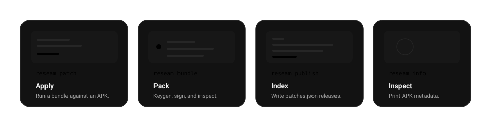

# Overview

`reseam` is Reseam's command-line tool. Patch authors use it to build, sign, test, and publish bundles. Anyone can use it to patch APKs on a computer without Reseam Manager.

| Command | What it does |
|---|---|
| [`reseam patch`](2_0_patch.md) | Applies patches from bundles to an APK and signs the result. |
| [`reseam perf`](2_5_perf.md) | Patches several times and reports how long each step took and how much memory it used. |
| [`reseam bundle`](3_0_bundle.md) | Creates signing keys, packs bundles, and lists what is in them. |
| [`reseam publish`](4_0_publish.md) | Adds a release to a `patches.json` or `manager.json` index. |
| [`reseam info`](5_0_info.md) | Prints an app's package, version, and size. |

Every command works on local files and never downloads anything. Add `--help` to any command for its flags.
